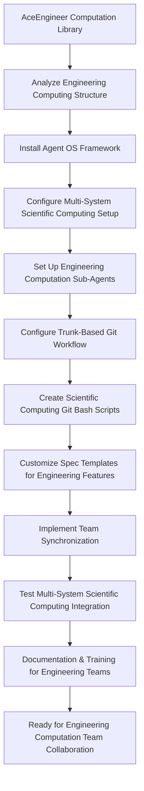

# Spec Requirements Document

> Spec: Agent OS Integration for AceEngineer Engineering Computation Library
> Created: 2025-07-30
> Status: Planning

## Executive Summary

**Prompt for Future Reuse:**
```
Set up buildermethods Agent OS (https://github.com/buildermethods/agent-os) for this Python-based engineering computation library with comprehensive team collaboration features. Execute the following implementation with logical task dependency ordering:

TASK DEPENDENCY ORDERING STANDARD:
- All implementation tasks must follow logical dependency ordering where prior tasks are always applicable (if logical) to subsequent tasks
- Each task builds upon the achievements of previous tasks
- Task dependencies must be explicitly documented
- Foundation tasks (like system installation) come before dependent tasks (like analysis or configuration)
- This ordering minimizes errors, reduces rework, and ensures consistent implementation success across different team members and environments

IMPLEMENTATION STEPS:

1. INSTALL AGENT OS WITH MULTI-SYSTEM CONFIGURATION:
   Prerequisites: None - Foundation task
   - Install the framework at system level for Windows, Linux, macOS, or Unix
   - Configure system-level paths, environment variables, and shell integration
   - Set up cross-platform compatibility and OS-specific shell integration
   - Validate system installation with cross-platform compatibility tests

2. ANALYZE EXISTING ENGINEERING COMPUTATION LIBRARY:
   Depends on: Task 1 - System installation required to run @analyze-product
   - Run: @analyze-product "I want to install Agent OS in this existing Python engineering computation library"
   - Document current scientific computing structure, mathematical analysis modules, and development workflow
   - Identify integration points for the framework with engineering computation context
   - Create comprehensive analysis report for scientific computing repository integration

3. REPOSITORY INTEGRATION AND CONFIGURATION:
   Depends on: Task 2 - Analysis results guide repository configuration
   - Install and configure the framework in this engineering computation repository based on analysis results
   - Create .agent-os directory structure with sub-agents folder for scientific computing workflow
   - Configure repository-level settings for multi-system team synchronization with engineering computation context
   - Always use /create-spec for specs and user stories related to mathematical analysis and engineering calculations

4. PROJECT SUB-AGENTS CONFIGURATION:
   Depends on: Task 3 - Repository structure and settings required for sub-agents
   - development-agent.md: Python scientific computing development and mathematical analysis workflows for this engineering library
   - testing-agent.md: Automated testing for engineering calculations, mathematical models, and scientific computation validation
   - deployment-agent.md: Scientific computing package deployment and engineering library distribution process
   - Configure sub-agents for cross-system synchronization with scientific computing focus

5. TRUNK-BASED GIT DEVELOPMENT WORKFLOW:
   Depends on: Task 4 - Sub-agents provide the automation foundation for git workflows
   - Configure trunk-based git development workflow for each spec with scientific computing context
   - Set up automated branching and merge workflows for engineering calculation features and mathematical analysis modules
   - Implement feature flags for continuous integration support with scientific computing pipeline

6. OS-SPECIFIC GIT BASH AUTOMATION SCRIPTS:
   Depends on: Task 5 - Git workflow structure required before creating automation scripts
   - create-spec-branch.sh: Automated spec branch management for engineering computation features
   - sync-team-state.sh: Cross-system project synchronization for scientific computing development
   - merge-spec-completion.sh: Automated spec completion workflows for mathematical analysis features
   - Create OS-specific versions for Windows PowerShell, Linux/Unix bash, and macOS zsh/bash
   - development-tasks.sh: Common scientific computing task automation (environment setup, calculation validation, etc.)

7. ENHANCED SPEC TEMPLATES:
   Depends on: Task 6 - Automation scripts inform template workflow integration
   - Store all specs in .agent-os/specs/ folder with date-based naming for engineering computation features
   - Include executive summary in every spec with original prompt and mermaid flowcharts for scientific computing workflows
   - Modify spec templates to include reusable prompt capture for engineering computation library development
   - Ensure prompt completeness and self-containment for any scientific computing development team

8. TEAM SYNCHRONIZATION FEATURES:
   Depends on: Task 7 - Templates and workflows must be established before team synchronization
   - Configure project-level and user-level settings for scientific computing development teams
   - Implement cross-system state synchronization for engineering computation environments
   - Enable consistent behavior across different development environments with Python scientific computing context
   - Support distributed team collaboration with trunk-based development for engineering computation library

9. TESTING AND VALIDATION:
   Depends on: Task 8 - All components must be implemented before comprehensive testing
   - Write comprehensive tests for system-level installation across all supported operating systems
   - Test OS-specific installation scenarios (Windows, Linux, macOS, Unix) with scientific computing tools
   - Test complete multi-system workflow from spec creation to completion for engineering computation features
   - Validate team synchronization and sub-agent functionality across different scientific computing environments

10. DOCUMENTATION AND TEAM TRAINING:
    Depends on: Task 9 - System must be tested and validated before documentation and training
    - Document system-level installation procedures for all supported operating systems with scientific computing context
    - Update documentation with comprehensive workflow instructions for this engineering computation library
    - Create team training documentation for new trunk-based development workflow with mathematical analysis focus
    - Provide multi-system setup guide for distributed scientific computing team members
    - Create reusable implementation guide that can be applied to other Python/scientific computing repositories

DELIVERABLES:
- Fully integrated Agent OS system with multi-platform support for Python/scientific computing development
- Custom spec templates with executive summaries and mermaid flowcharts for engineering computation workflows
- Cross-platform git bash automation scripts optimized for scientific computing and mathematical analysis development
- Multi-system team synchronization capabilities for engineering computation teams
- Comprehensive documentation and training materials for scientific computing workflows
- Established task dependency ordering framework for future engineering computation implementations

This setup enables your engineering computation team to use Agent OS for structured, synchronized, and automated development workflows across multiple systems and team members with logical task dependencies that ensure implementation success for Python scientific computing applications and mathematical analysis libraries.
```

**Process Flow:**


## Overview

Integrate Agent OS development framework into this Python-based engineering computation library repository to enable multi-system team collaboration with trunk-based development, automated git bash workflows, and synchronized sub-agents. This integration will provide structured spec creation, task management, and standardized documentation processes optimized for distributed scientific computing teams working on mathematical analysis, engineering calculations, and computational modeling applications.

## User Stories

### Multi-System Engineering Computation Team Collaboration

As an engineering developer working on this scientific computation library across multiple systems, I want to use Agent OS with trunk-based development and automated git bash scripts, so that I can collaborate seamlessly with team members while maintaining consistent workflows and synchronized states for both mathematical analysis development and engineering calculation validation tasks.

**Detailed Workflow:**
1. Developer creates new engineering computation spec using `/create-spec` command
2. The system automatically creates trunk-based git branch for this scientific computing spec
3. Sub-agents are configured in .agent-os folder for engineering computation team synchronization
4. Git bash scripts automate Python scientific computing tasks, mathematical analysis validation, and library testing
5. All team members work on main branch with feature flags and continuous integration for engineering features
6. Spec completion automatically merges changes and updates the scientific computing library state

### System-Level Agent OS Installation for Scientific Computing

As a scientific computing team member setting up this engineering computation project on my system, I want Agent OS to be properly installed at the system level for my operating system, so that I can use the framework consistently for Python scientific computing and mathematical analysis work regardless of whether I'm on Windows, Linux, macOS, or Unix, with all commands and tools properly configured for engineering computation environments.

**Detailed Workflow:**
1. System detects current operating system (Windows, Linux, macOS, Unix)
2. Downloads and installs appropriate Agent OS system components for the OS with scientific computing support
3. Configures system-level paths, environment variables, and shell integration for Python scientific computing development
4. Sets up OS-specific git bash environment and permissions for engineering computation workflows
5. Validates installation with cross-platform compatibility tests including Python mathematical libraries
6. Enables seamless `/create-spec` and other Agent OS commands for engineering computation features

### Engineering Computation Library Management

As a manager of this Python scientific computing library project, I want Agent OS to provide multi-system synchronization with standardized spec creation for both mathematical analysis features and engineering calculation validation tasks, so that distributed team members can work consistently on scientific computing regardless of their development environment while maintaining full traceability of engineering computation requirements and technical decisions.

**Detailed Workflow:**
1. Team member creates engineering computation spec using standardized `/create-spec` process
2. Executive summary captures original prompt for future reference in scientific computing context
3. Mermaid flowcharts visualize engineering computation process flows and mathematical analysis workflows
4. Sub-agents ensure consistent behavior across all team systems for Python scientific computing development
5. Trunk-based development enables continuous integration without branch conflicts for engineering features
6. Git bash automation handles routine Python environment setup, calculation validation, and scientific computing deployment tasks

## Spec Scope

1. **Task Dependency Ordering Requirement** - All implementation tasks must follow logical dependency ordering where prior tasks are always applicable (if logical) to subsequent tasks, ensuring each step builds upon previous achievements for engineering computation workflows
2. **System-Level Agent OS Installation** - Install and configure the framework at system level for Windows, Linux, macOS, and Unix environments with scientific computing tool support
3. **Repository Integration** - Install and configure the framework in this Python engineering computation repository using @analyze-product approach (depends on system installation)
4. **Scientific Computing Sub-Agents Configuration** - Set up repository sub-agents in .agent-os folder for team synchronization using Python scientific computing and mathematical analysis technology stack (depends on repository integration)
5. **Trunk-Based Git Development** - Configure trunk-based development workflow for each spec with automated branching for engineering computation features (depends on sub-agents)
6. **Cross-Platform Scientific Computing Git Bash Automation** - Create OS-specific git bash scripts for Python development, mathematical analysis, testing, and scientific library deployment (depends on git workflow)
7. **Multi-System Team Synchronization** - Implement system-level configurations for consistent team collaboration across different operating systems for scientific computing (depends on automation scripts)
8. **Enhanced Spec Templates** - Modify templates to include executive summary with prompt capture and mermaid diagrams for engineering computation workflows (depends on synchronization setup)

## Out of Scope

- Modification of existing engineering calculation algorithms or mathematical models
- Changes to the current scientific computing methodologies or analysis approaches
- Integration with external engineering software beyond Agent OS
- Custom features beyond the specified Agent OS customizations
- Python-specific implementations (the solution should work with current scientific computing stack)

## Expected Deliverable

1. **Fully Integrated System** - Agent OS framework successfully installed and configured in this Python engineering computation repository
2. **Custom Scientific Computing Spec Templates** - Modified templates that automatically include executive summary sections with reusable prompts and mermaid flowcharts for engineering computation and mathematical analysis workflows
3. **Updated Engineering Development Workflow** - Team can use `/create-spec` command to generate structured specifications that work with Python scientific computing and mathematical analysis technology stack
4. **Logical Task Dependency Framework** - Established pattern of task ordering where each step builds upon previous achievements for maximum efficiency and reduced errors in scientific computing development
5. **Reusable Implementation Guide** - Complete documentation that enables this setup to be replicated in other Python/scientific computing repositories

## Future Spec Requirements

**Executive Summary Prompt Completeness Standard**: All specs created using Agent OS must include a complete, self-contained "Prompt for Future Reuse" in the executive summary that:
- Contains all necessary information for any engineering computation project team to implement without external references
- Includes the Task Dependency Ordering Standard as defined below
- Documents all implementation steps with explicit dependencies for Python/scientific computing development
- Lists all expected deliverables and outcomes for engineering computation workflows
- Uses generic language (pronouns, common nouns) for repository adaptability across scientific computing projects
- Provides sufficient context for successful implementation across different engineering computation environments

**Task Dependency Ordering Standard**: All future specs created using Agent OS must follow the logical dependency ordering principle established in this specification, where:
- Prior tasks are always applicable (if logical) to subsequent tasks in engineering computation workflows
- Each task builds upon the achievements of previous tasks for Python scientific computing and mathematical analysis development
- Task dependencies are explicitly documented in both the prompt and task sections
- Foundation tasks (like system installation) come before dependent tasks (like Python environment configuration or mathematical library setup)
- This ordering minimizes errors, reduces rework, and ensures consistent implementation success across different engineering computation team members and environments

## Spec Documentation

- Tasks: @.agent-os/specs/2025-07-30-agent-os-integration/tasks.md
- Technical Specification: @.agent-os/specs/2025-07-30-agent-os-integration/sub-specs/technical-spec.md
- Tests Specification: @.agent-os/specs/2025-07-30-agent-os-integration/sub-specs/tests.md